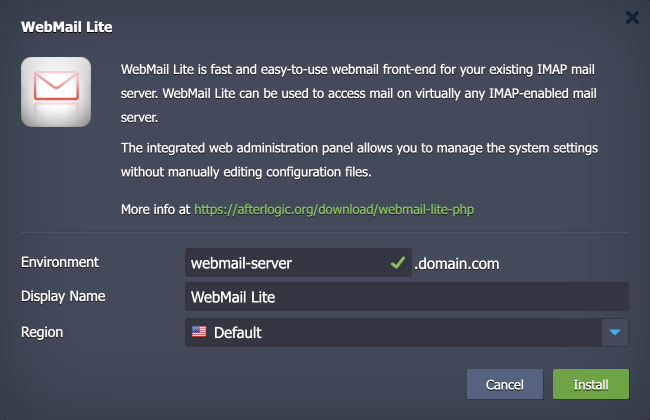

 

# WebMail Lite

The package deploys the [WebMail Lite](https://afterlogic.org/download/webmail-lite-php) solution - an open-source, fast and easy-to-use webmail front-end for your existing IMAP mail server. WebMail Lite can be used to access mail on virtually any IMAP-enabled mail server.

## Environment Topology

This package creates a dedicated WebMail Lite environment that contains one application server and one database container. It automatically deploys and sets the WebMail Lite application. The automatic vertical scaling is enabled out of the box, and [horizontal scaling](https://www.virtuozzo.com/application-platform-docs/automatic-horizontal-scaling/) can be configured (if needed). The default software stacks utilized in the package are the following:

- NGINX PHP application server (PHP 8.2)
- MySQL 8 database
- WebMail Lite 8.5.3

## Deployment to Cloud

To get your WebMail Lite solution, click the "**Deploy to Cloud**" button below, specify your email address within the widget, choose one of the [Virtuozzo Public Cloud Providers](https://www.virtuozzo.com/application-platform-partners/), and confirm by clicking **Install**.

> If you already have a Virtuozzo Application Platform (VAP) account, you can deploy this solution from the [Marketplace](https://www.virtuozzo.com/application-platform-docs/marketplace/) or [import](https://www.virtuozzo.com/application-platform-docs/environment-import/) a manifest file from this repository.

## Installation Process

In the opened installation window at the VAP dashboard, provide a preferred environment and display names, choose a region (if available), and confirm the installation.

Your WebMail Lite application will be automatically installed in a few minutes.
